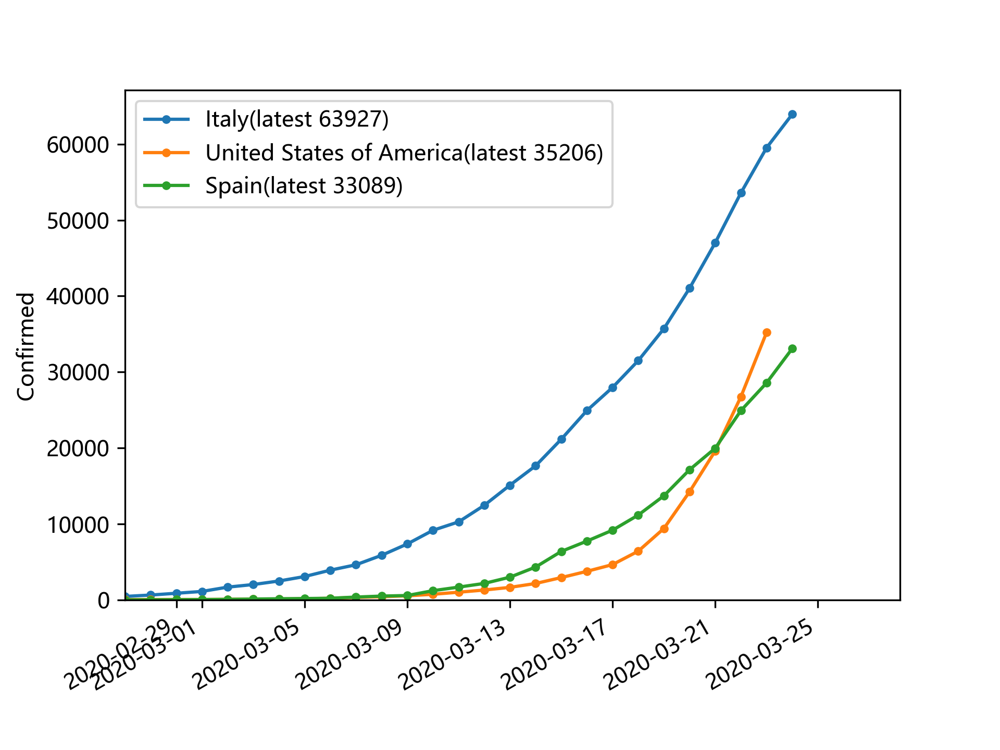
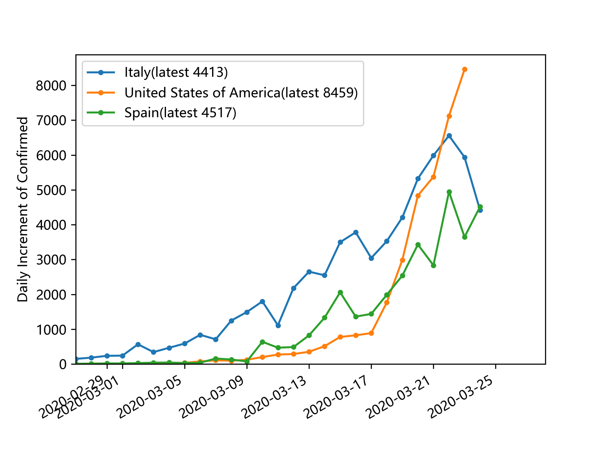

## Data source
https://github.com/open-covid-19/data

## Outputs
Plot the timehistory of COVID-19 confirmed/dead cases **worldwide**.
(Another repository, https://github.com/lyupin/Visualize-DXY-2019-nCov-Data , is written for cases **in China**.)

